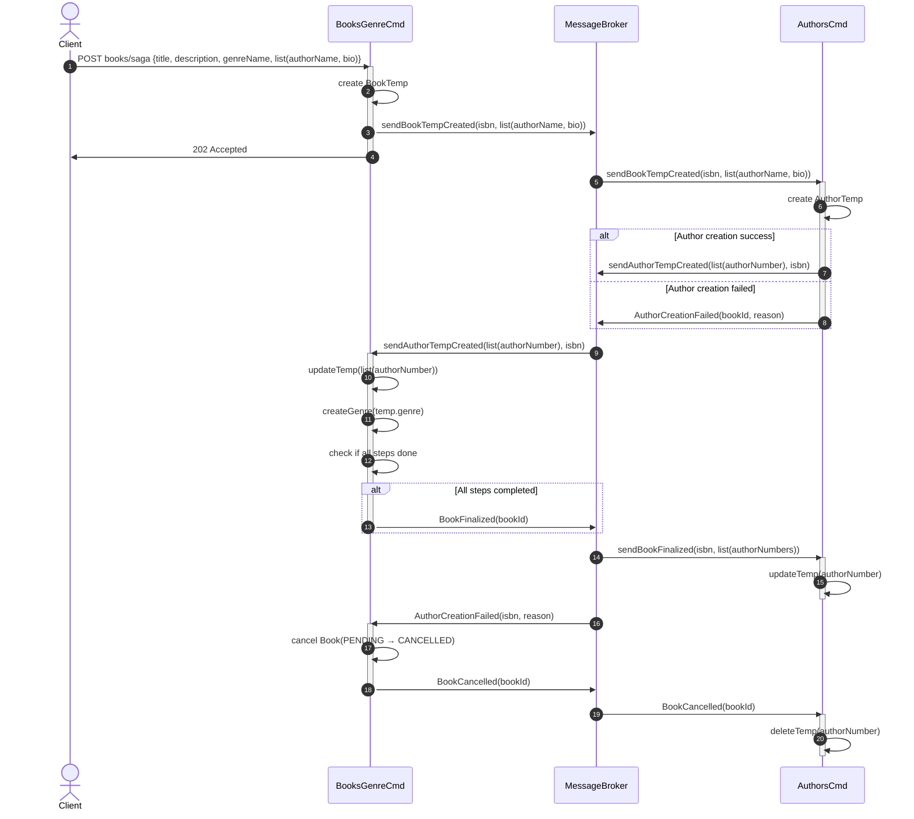

#  As a librarian, I want to create a Book, Author and Genre in the same process.

---

## Objetivo do Design

O objetivo principal deste design é fornecer a visão para a criação de um **Livro (Book)**, de um **Author (Author)** e de um **Género (Genre)** no mesmo processo, garantindo consistência nos dados e eficiência operacional.

---

## Cenários de Atributos de Qualidade

| **Elemento**          | **Descrição**                                                                                                                          |
|------------------------|----------------------------------------------------------------------------------------------------------------------------------------|
| **Estímulo**           | O sistema deve permitir a criação de um Book, Author e Genre no mesmo pedido.                                                          |
| **Fonte do Estímulo**  | Utilizador (bibliotecário) pretende criar um Book, Author e Genre no mesmo processo.                                                   |
| **Ambiente**           | Sistema em produção, acessível por API.                                                                                                |
| **Artefacto**          | Módulos de gestão de dados de Book, Genre, Author e autenticação.                                                                      |
| **Resposta**           | Criação com sucesso de Book, Genre e Author, com validação de integridade. Em caso de falha, todas as alterações devem ser revertidas. |
| **Medida da Resposta** | Conclusão em menos de 1 segundos e sem inconsistências entre entidades.                                                                |

---

## Memorando Técnico

### Problema
Na sprint anterior, foi desenvolvida a aplicação LMS com arquitetura monolítica. Apesar de funcional, esta abordagem centralizada limita **desempenho, disponibilidade, escalabilidade e elasticidade**, tornando difícil lidar com picos de carga e evoluir funcionalidades de forma independente.

### Resumo da Solução
Adotar uma arquitetura **descentralizada/distribuída baseada em microserviços**, aplicando:
- **Saga** para gerir a transação distribuída entre os serviços `BooksGenre` e `Authors`, garantindo consistência lógica.
- **Messaging (RabbitMQ)** para comunicação assíncrona entre serviços e para acionar compensações em caso de falha.
- **Outbox** para publicação confiável de eventos, garantindo atomicidade entre escrita local e envio da mensagem.
- **CQRS** para separar responsabilidades de command e query, permitindo otimizar consultas de Books ou authors, que são mais frequentes que operações de escrita.

### Fatores
- Cada serviço (BookGenre, Authors) deve operar de forma independente, mas coordenada.
- Garantir rollback consistente em caso de falha.
- Robustez contra falhas de rede ou indisponibilidade temporária.
- Escalabilidade seletiva para lidar com picos de registos.

### Solução
- **Messaging**: Utilizar RabbitMQ para troca de eventos e compensações.
- **Saga**: Implementar um fluxo coreografado que:
    1. Cria Book temporário.
    2. Cria Author temporário.
    3. Atualiza Book temporário com author temporário.
    4. Cria Genre e persiste.
    5. Persiste Book.
    6. Persiste Author.
    4. Em caso de falha, Book não passa de temporário e Author é removido.
- **Outbox**: Garantir publicação atómica dos eventos de criação.
- **CQRS**: Separar operações de leitura e escrita para otimizar consultas.

### Motivação
A motivação para esta solução é garantir que a criação de um Book, Author e Genre seja tratada de forma transacional do ponto de vista do negócio, ou seja, ou são criados com sucesso ou, em caso de falha, nenhuma criação deve persistir.  
O uso do padrão **Saga** proporciona robustez para lidar com falhas em sistemas distribuídos, evitando inconsistências sem recorrer a transações distribuídas (ACID), que são complexas e pouco escaláveis.  
O padrão **CQRS** facilita a escalabilidade e organização dos serviços, separando operações de leitura das operações de escrita.  
**Messaging** e **Outbox** asseguram comunicação confiável e desacoplamento temporal entre serviços.

### Alternativas
- **Manter Arquitetura Monolítica**: Continuar com um único sistema que gere Book, Author e Genre, com transações locais (Baixa escalabilidade, difícil evolução independente, risco de bottlenecks em picos de carga.).
- **Transações Distribuídas (ACID)**: Usar 2PC para garantir atomicidade global (descartado por complexidade e impacto negativo na performance).
- **Orquestração com Serviço Central**: Um serviço orquestrador controla todo o fluxo da criação (Maior visibilidade e controlo, mas introduz acoplamento e ponto único de falha)

### Questões Pendentes
- Como garantir que as compensações sejam tratadas corretamente em todos os serviços?
- Como monitorizar o estado da Saga e detetar falhas rapidamente?
- Como lidar com falhas no broker durante a publicação de eventos?

---

## Vista de processos

## Vista de processos

### Tabela de Decisões de Design

| Decisão | Opção Escolhida             | Alternativas Rejeitadas | Razão |
|---------|-----------------------------|-------------------------|-------|
| **Coordenação** | Saga Coreografada           | Saga Orquestrada        | Fluxo complexo com 2+ passos, necessita visibilidade centralizada |
| **Comunicação** | Messaging Assíncrono        | REST síncrono           | Desacoplamento temporal, resiliência a falhas de rede |
| **Consistência** | Eventual Consistency + Saga | Transações ACID (2PC)   | Escalabilidade, evita locks distribuídos |
| **Publicação Eventos** | Outbox Pattern              | Publicação direta       | Garante atomicidade (BD + Evento) |
| **CQRS** | Sim                         | Não                     | Leituras >> Escritas, permite otimização separada |
| **Database** | Database per Service        | Shared Database         | Isolamento, autonomia, bounded contexts |
| **Message Broker** | RabbitMQ                    | Kafka, Redis Streams    | Mais simples para use case, suporta routing flexível |
| **Compensação** | Automática via Saga         | Manual                  | Reduz erros humanos, resposta rápida |