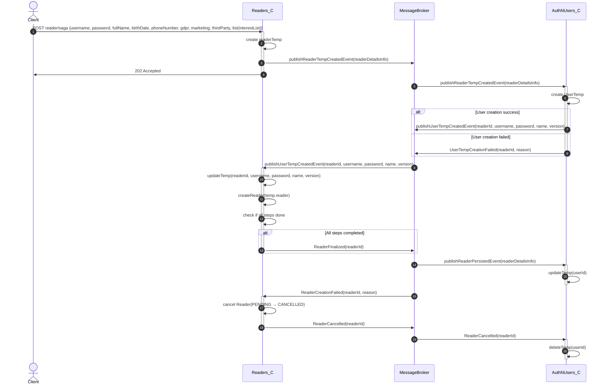

# As a librarian, I want to create a Reader and the respective User in the same request.

---

## Objetivo do Design

O objetivo principal deste design é fornecer a visão para a criação de um **Leitor (Reader)** e do respetivo **Utilizador (User)**, permitindo que ambos sejam geridos no mesmo processo, garantindo consistência nos dados, segurança na autenticação e eficiência operacional.

---

## Cenários de Atributos de Qualidade

| **Elemento**          | **Descrição**                                                                                                                         |
|------------------------|---------------------------------------------------------------------------------------------------------------------------------------|
| **Estímulo**           | O sistema deve permitir a criação de um Reader e o respetivo User no mesmo pedido.                                                  |
| **Fonte do Estímulo**  | Utilizador (bibliotecário) pretende criar um Reader e o respetivo User no mesmo processo.                                           |
| **Ambiente**           | Sistema em produção, acessível por API.                                                                                             |
| **Artefacto**          | Módulos de gestão de dados de Reader, User e autenticação.                                                                          |
| **Resposta**           | Criação com sucesso de Reader e User, com validação de integridade. Em caso de falha, todas as alterações devem ser revertidas.     |
| **Medida da Resposta** | Conclusão em menos de 1 segundos e sem inconsistências entre entidades.                                                             |

---

## Memorando Técnico

### Problema
Na sprint anterior, foi desenvolvida a aplicação LMS com arquitetura monolítica. Apesar de funcional, esta abordagem centralizada limita **desempenho, disponibilidade, escalabilidade e elasticidade**, tornando difícil lidar com picos de carga e evoluir funcionalidades de forma independente.

### Resumo da Solução
Adotar uma arquitetura **descentralizada/distribuída baseada em microserviços**, aplicando:
- **Saga** para gerir a transação distribuída entre os serviços `Users` e `Readers`, garantindo consistência lógica.
- **Messaging (RabbitMQ)** para comunicação assíncrona entre serviços e para acionar compensações em caso de falha.
- **Outbox** para publicação confiável de eventos, garantindo atomicidade entre escrita local e envio da mensagem.
- **CQRS** para separar responsabilidades de leitura e escrita, permitindo otimizar consultas de Readers, que são mais frequentes que operações de escrita.

### Fatores
- Cada serviço (Users, Readers) deve operar de forma independente, mas coordenada.
- Garantir rollback consistente em caso de falha.
- Robustez contra falhas de rede ou indisponibilidade temporária.
- Escalabilidade seletiva para lidar com picos de registos.

### Solução
- **Messaging**: Utilizar RabbitMQ para troca de eventos e compensações.
- **Saga**: Implementar um fluxo coreografado que:
    1. Cria User temporário.
    2. Cria Reader associado.
    3. Persiste ambos.
    4. Em caso de falha, Reader não passa de temporário e User é removido.
- **Outbox**: Garantir publicação atómica dos eventos de criação.
- **CQRS**: Separar operações de leitura e escrita para otimizar consultas.

### Motivação
A motivação para esta solução é garantir que a criação de um Reader e User seja tratada de forma transacional do ponto de vista do negócio, ou seja, ou ambos são criados com sucesso ou, em caso de falha, nenhuma criação deve persistir.  
O uso do padrão **Saga** proporciona robustez para lidar com falhas em sistemas distribuídos, evitando inconsistências sem recorrer a transações distribuídas (ACID), que são complexas e pouco escaláveis.  
O padrão **CQRS** facilita a escalabilidade e organização dos serviços, separando operações de leitura das operações de escrita.  
**Messaging** e **Outbox** asseguram comunicação confiável e desacoplamento temporal entre serviços.

### Alternativas
- **Sistema Monolítico**: Um único serviço para Reader e User (descartado por falta de escalabilidade e isolamento).
- **Transações Distribuídas (ACID)**: Usar 2PC para garantir atomicidade global (descartado por complexidade e impacto negativo na performance).

### Questões Pendentes
- Como garantir que as compensações sejam tratadas corretamente em todos os serviços?
- Como monitorizar o estado da Saga e detetar falhas rapidamente?
- Como lidar com falhas no broker durante a publicação de eventos?

---

Vista de Processo

