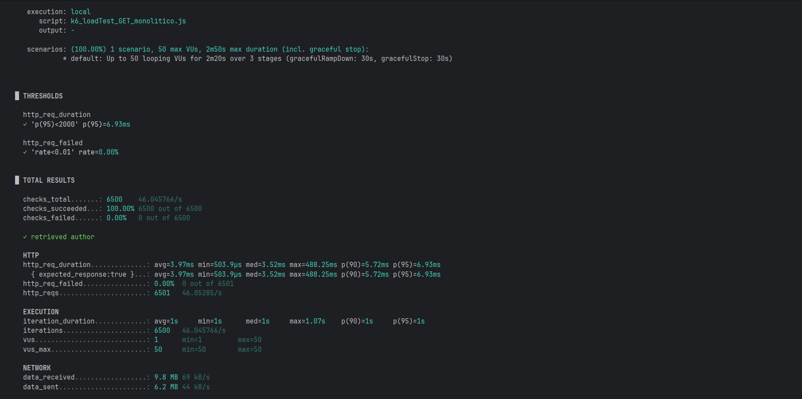
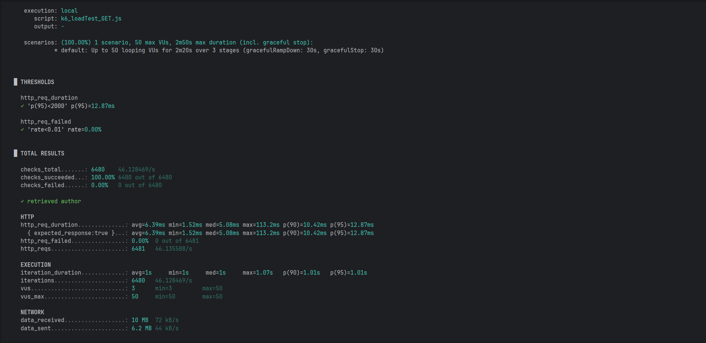

# Documentação ARQSOFT (Arquitetura de Software)

Este documento serve para toda a documentação do projeto para a unidade curricular de Arquitetura de Software (ARQSOFT)

---
## Architectural Software Requirements (ASR)

### Contexto
O sistema LMS (Library Management System) é um serviço backend responsável pela gestão de uma biblioteca. O sistema disponibiliza um conjunto de endpoints que permitem a interação com as suas funcionalidades principais, incluindo a gestão de livros, géneros, autores, leitores e empréstimos. Através destes serviços, é possível realizar operações de consulta, criação, atualização e eliminação dos diferentes recursos.

No sprint/projeto anterior, a aplicação LMS foi desenvolvida como monólito modular, mas verificou-se que esta arquitetura centralizada limita significativamente a performance, disponibilidade, escalabilidade e elasticidade.

### Problemas
Nesta nova iteração, devem ser resolvidos os seguintes problemas:

- **Disponibilidade**: Necessidade de garantir uptime elevado mesmo com falhas em micro-serviços, mensagens ou base de dados.
- **Performance em Alta Demanda**: O sistema deve aumentar a performance em 25% quando em situações de elevada procura (>Y pedidos por período).
- **Uso Eficiente de Recursos**: Hardware deve ser utilizado de forma parcimoniosa, escalando apenas quando picos de demanda (>Y requests/período) ocorrem.
- **Modifiabilidade**: Os clientes de software não devem ser afetados por mudanças na API, exceto em casos extremos.
- **Estratégia SOA**: Adesão à estratégia corporativa de API-led connectivity para facilitar integrações.

### Requisitos Funcionais

#### US1 - Tiago Oliveira (1201360)
Como bibliotecário, quero criar um Livro, Autor e Género no mesmo processo, de forma atómica e consistente.

**Documentação detalhada**: [US1.md](ADD/US1.md)

#### US2 - Pedro Costa (1201576)
Como bibliotecário, quero criar um Leitor e o respetivo Utilizador no mesmo pedido, garantindo atomicidade entre os microserviços de autenticação e leitores.

**Documentação detalhada**: [US2.md](ADD/US2.md)

#### US3 - Diogo Pereira (1221137)
Como leitor, quando retorno um livro, quero deixar um comentário de texto sobre o livro e avaliá-lo, de forma atómica e consistente.

**Documentação detalhada**: [US3.md](ADD/US3.md) - TODO

### Requisitos Não Funcionais

#### RNF1 - Availability
O sistema deve melhorar a sua disponibilidade.

#### RNF2 - Performance
O sistema deve aumentar o desempenho em 25% quando em situações de elevada procura (>Y pedidos por período).

#### RNF3 - Scalability
O sistema deve usar hardware de forma parcimoniosa, escalando apenas quando necessário.

#### RNF4 - Modifiability
Os clientes de software não devem ser afetados por eventuais alterações na API, exceto em casos extremos.

#### RNF5 - SOA Strategy
O sistema deve aderir à estratégia SOA da empresa, nomeadamente API-led connectivity.

---

## Tabela de Fatores Arquiteturais

| Fator              | Qualidade do Cenário                                                                    | Variabilidade                                               | Impacto nos Stakeholders                                                        | Frequência | Risco      | Prioridade |
|--------------------|-----------------------------------------------------------------------------------------|-------------------------------------------------------------|---------------------------------------------------------------------------------|------------|------------|------------|
| **Availability**   | Falha em microserviço/RabbitMQ/H2 não deve causar indisponibilidade total do sistema    | Falhas pontuais vs. falhas sistémicas                       | Utilizadores não conseguem aceder ao sistema, perda de receita                  | Regular    | Alto       | **4**      |
| **Performance**    | Sistema deve aumentar performance em 25% com >Y requests/período                        | Carga normal vs. picos de demanda                           | Degradação da experiência do utilizador, timeout em clientes                    | Às vezes   | Alta       | **3**      |
| **Scalability**    | Sistema deve escalar horizontalmente sem waste de recursos em períodos de baixa demanda | Demanda variável ao longo do dia                            | Custos operacionais de infraestrutura, sustentabilidade                         | Às vezes   | Média      | **3**      |
| **Modifiability**  | Mudanças na API não devem quebrar clientes existentes                                   | API versioning, backward compatibility                      | Clientes externos quebram, necessidade de atualizações forçadas                 | Regular    | Alta       | **4**      |
| **SOA Strategy**   | Novas integrações devem reutilizar System APIs existentes                               | Número de integrações (CRM, Mobile, Partners)               | Time-to-market de novas features, duplicação de código entre equipas            | Regular    | Média      | **3**      |
| **US1**            | Criar Livro + Autor + Género no mesmo processo                                          | Atomicidade de transação distribuída                        | Dados inconsistentes se falha parcial                                           | Regular    | Alta       | **4**      |
| **US2**            | Criar Reader + User no mesmo pedido                                                     | Atomicidade entre Identity e Readers contexts               | Dados inconsistentes se falha parcial                                           | Regular    | Alta       | **4**      |
| **US3**            | Deixar comentário e avaliação sobre livro ao retorná-lo                                 | Atomicidade entre Lending e Outbox; versionamento optimista | Feedback perdido ou inconsistente com lending; race conditions em concorrência  | Regular    | Alta       | **4**      |

---
## Attribute-driven design (ADD)

### Quality Attribute Scenario - Criar Book, Author e Genre no mesmo pedido
[US1.md](ADD/US1.md)

### Quality Attribute Scenario - Criar Reader e respetivo User no mesmo pedido
[US2.md](ADD/US2.md)

### Quality Attribute Scenario - Deixar comentário e avaliação sobre livro ao retorná-lo
[US3.md](ADD/US3.md)

### Quality Attribute Scenario - Availability
[Availability.md](ADD/QA/Availability.md)

### Quality Attribute Scenario - Performance
[Performance.md](ADD/QA/Performance.md)

### Quality Attribute Scenario - Scalability
[Scalability.md](ADD/QA/Scalability.md)

### Quality Attribute Scenario - Modifiability
[Modifiability.md](ADD/QA/Modifiability.md)

### Quality Attribute Scenario - SOA Strategy
[SOA_Strategy.md](ADD/QA/SOA_Strategy.md)

---

## System-to-be

### Vista Lógica

#### Nível 1

#### Nível 2

#### Nível 3

### Vista Física

#### Nível 2

### Vista Implementação

#### Nível 3

---

## Microserviços
### Justificação para adoção de microserviços

A adoção de uma arquitetura de microserviços oferece diversas vantagens em comparação com uma abordagem monolítica, especialmente à medida que a aplicação cresce em complexidade e escala.
- **Escalabilidade**: Permite a escalabilidade independente de serviços específicos, otimizando recursos. Por exemplo, se o módulo de "Consulta de Autores" tiver mais uso, apenas ele vai/pode ser escalado.
- **Flexibilidade**: Cada serviço é isolado, o que facilita a realização de alterações, correções ou atualizações em partes específicas sem impactar o resto.
- **Resiliência**: Cada serviço é isolado e independente, ou seja, mesmo que um serviço falhe, outros vão continuar a funcionar. Por exemplo, caso o serviço de Authors falhem, os Books vão continuar a funcionar.
- **Reutilização**: Um serviço pode ser reutilizado em vários projetos. Por exemplo, o serviço de Autenticação pode servir diferentes aplicações.

### **1. Microserviço de Utilizadores e Autenticação (AuthnUsers)**
- **Justificação**: Gerir utilizadores e a sua autenticação é um aspeto fundamental do sistema que opera de forma independente dos demais componentes. Este microserviço encapsula funcionalidades como o registo de utilizadores, autenticação e autorização. Ao isolar essas operações, garantimos que preocupações de segurança, como gestão de senhas e geração de tokens, sejam tratadas em um serviço dedicado, reduzindo a complexidade e vulnerabilidades noutras partes do sistema.
- **Impacto**:
  - Escalabilidade independente para lidar com grandes volumes de requisições de login e autenticação.
  - Simplificação da integração com provedores de autenticação de terceiros.
  - Maior segurança ao isolar operações sensíveis dos demais serviços existentes.

### **2. Microserviço de Livros e Géneros (BookGenre)**
- **Justificação**: Os livros representam o agregado central do domínio, sendo responsáveis por coordenar o processo de criação das restantes entidades. O género, apesar de ser um conceito distinto, não possuía operações de comando no sistema original, sendo apenas utilizado no contexto dos livros. Assim, a decisão de manter livros e géneros no mesmo microserviço garante maior coesão do domínio e evita complexidade desnecessária associada à comunicação distribuída.
- **Impacto**:
  - Simplificação da implementação da saga de criação de livros, permitindo a persistência consistente de livros e géneros.
  - Redução de dependências entre microserviços e menor sobrecarga de eventos.
  - Manutenção de uma arquitetura flexível, possibilitando a separação futura do género caso venha a adquirir lógica de negócio própria.

### **3. Microserviço de Autores (Authors)**
- **Justificação**: Autores representam um domínio distinto que requer lógica e gestão próprias. Este microserviço faz a gestão de dados específicos sobre autores, como informações sobre nome e biografia. Ao isolar essa funcionalidade, permitimos que as operações relacionadas a autores evoluam de forma independente dos livros e géneros.
- **Impacto**:
  - Suporte à escalabilidade para recursos centrados em autores, como procuras, filtros e atualizações de autores.
  - Redução da complexidade noutros serviços ao encapsular a lógica específica de autores.

### **4. Microserviço de Leitores (Readers)**
- **Justificação**: Os leitores representam os utilizadores do sistema que interagem com os livros através de lendings. Este microserviço é responsável pela gestão da identidade e estado dos leitores, bem como pelas regras associadas à realização de lendings, isolando essa lógica do domínio dos livros.
- **Impacto**:
  - Separação clara entre a gestão de utilizadores/leitores e o catálogo de livros.
  - Facilita a evolução independente das regras de negócio relacionadas com empréstimos.
  - Melhora a escalabilidade e manutenção das funcionalidades associadas aos leitores e às suas interações com os livros.

### **5. Microserviço de Empréstimos (Lendings)**
- **Justificação**: Os empréstimos representam um processo central do sistema, com regras de negócio próprias (lendings overdue, duração média, limite por leitor   ). Este microserviço isola essa lógica, garantindo que a gestão dos empréstimos é independente dos domínios de livros e leitores.
- **Impacto**:
  - Encapsulamento das regras de negócio relacionadas com empréstimos.
  - Permite escalar e evoluir o serviço sem impactar diretamente os restantes microserviços.

---

## Performance

De forma a entender a diferença da performance entre a aplicação base e a aplicação em microserviços foram realizados testes através da ferramenta K6. Foram feitos load tests para entender como as aplicações se comportavam sob carga.

Para estes testes, foi considerado o cenário em que existe um ramp up inicial gradual durante 10 segundos até os 50 users, depois aguenta essa carga durante 120 segundos, e por fim volta de forma gradual aos 0 users durante 10 segundos.

Os resultados foram os seguintes.

### Get author by name

#### Aplicação Monolítica

#### Aplicação Distribuída

Com base nos resultados obtidos, verifica-se que a aplicação monolítica apresenta tempos de resposta inferiores em todas as métricas analisadas (média, mediana e percentis p90 e p95), quando comparada com a aplicação distribuída. 

Em particular, o valor de p95 da aplicação distribuída é aproximadamente o dobro do observado na aplicação monolítica, refletindo o overhead introduzido pela execução em ambiente distribuído e pelo balanceamento de carga entre múltiplas réplicas (docker swarm).

### Create Author

#### Aplicação Monolítica

#### Aplicação Distribuída

Com base nos resultados obtidos, verifica-se que, para os pedidos POST, a aplicação monolítica apresenta tempos de resposta significativamente inferiores em todas as métricas analisadas (média, mediana e percentis p90 e p95), quando comparada com a aplicação distribuída.

Em particular, o valor de p95 da aplicação distribuída é substancialmente superior ao da aplicação monolítica (94.59 ms face a 6.98 ms), refletindo o overhead introduzido pela execução em ambiente distribuído, nomeadamente pelos mecanismos de isolamento dos containers, pelo balanceamento de carga e pela gestão de múltiplas instâncias da aplicação.

### Conlusão

Em termos globais, a aplicação monolítica apresenta melhor desempenho em ambos os tipos de pedidos. Os resultados inferiores da aplicação distribuída devem-se principalmente ao overhead introduzido pelo Docker Swarm, nomeadamente pelos mecanismos de encaminhamento e balanceamento de carga do routing mesh, que penalizam a latência em cenários de carga moderada, onde as vantagens da escalabilidade horizontal ainda não são evidentes.

Adicionalmente, importa referir que os testes foram executados num portátil com recursos limitados, o que potencia efeitos de contenção ao nível da CPU, memória e rede, penalizando de forma mais acentuada a aplicação distribuída, devido ao maior overhead associado à virtualização e ao isolamento dos containers.