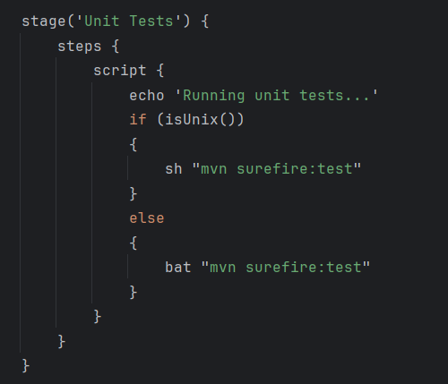
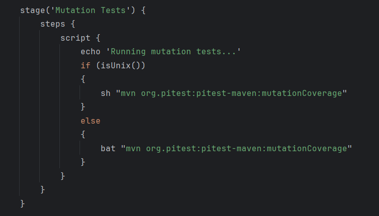
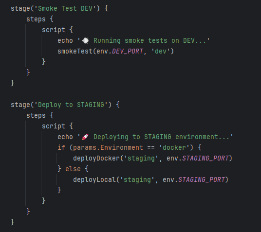
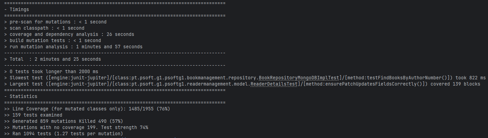

# Documentação de ODSOFT (Organização de Software)

## Análise à Pipeline

### Checkout


O stage Checkout é responsável por realizar a obtenção do código-fonte do repositório, garantindo que a pipeline tenha acesso à versão mais recente do projeto para execução dos próximos passos.


### Clean and Compile


O stage Clean and Compile é responsável por limpar e compilar o projeto. Primeiro executa a limpeza do projeto, removendo arquivos temporários e diretórios gerados em builds anteriores. A seguir, realiza a compilação do código-fonte e dos testes, convertendo os arquivos Java em bytecode e preparando o projeto para as etapas subsequentes da pipeline.


### Unit Tests


O stage Unit Tests é responsável por executar os testes unitários realizados, garantindo que as funcionalidades do código sejam validadas isoladamente e que comportamentos esperados estejam corretos antes de prosseguir para as próximas etapas.
É utilizado o plugin Maven Surefire para executar os testes. Se algum teste falhar, o Surefire reporta o erro e o pipeline é interrompido, impedindo que as próximas etapas sejam executadas.


### Integration Tests

O stage Integration Tests é responsável por executar os testes de integração, que verificam a interação entre diferentes módulos do sistema, garantindo que as partes do código funcionem corretamente quando integradas.
É utilizado o plugin Maven Failsafe para executar os testes. Se algum teste falhar, o Failsafe reporta o erro e o pipeline é interrompido, impedindo que as próximas etapas sejam executadas.


### Mutation Tests


O stage Mutation Tests é responsável por executar testes de mutação, que avaliam a qualidade e eficácia dos testes unitários existentes ao introduzir mudanças controladas no código. Isso ajuda a identificar se os testes são robustos o suficiente para capturar falhas potenciais.
É utilizado o PIT (Pitest), um framework de testes de mutação para Java, para executar os mesmos. O PIT gera um relatório de cobertura de mutação, mostrando a percentagem de mutações “mortas” (detetadas pelos testes) e “sobreviventes” (não detetadas).


### SonarQube Analysis


O stage SonarQube Analysis é responsável por executar a análise de qualidade do código com o SonarQube, identificando possíveis vulnerabilidades, problemas de segurança e verificando métricas de cobertura de testes. Isso ajuda a manter o código conforme as melhores práticas e padrões de qualidade.
A parte do Quality Gate é responsável por verificar automaticamente se o projeto cumpre os critérios mínimos de qualidade definidos no SonarQube. Caso passe os critérios, permite que a pipeline prossiga.


### Package


O stage Package realiza a geração do artefato do projeto (por exemplo, um arquivo JAR), garantindo que o pacote esteja pronto para implantação, mas sem executar os testes, acelerando o processo de empacotamento. Depois de realizar a geração do artefato, é armazenado o nome do ficheiro que será usado nos stages de Deploy.


### Install


O stage Install é responsável por instalar o artefato do projeto gerado no passo anterior, tornando-o disponível para outros módulos ou projetos que dependam dele.


### Deploy


Após a construção e testes, a pipeline realiza deploy sequencial em três ambientes:

| Ambiente   | Porta  | Objetivo        |
| ---------- |--------| --------------- |
| DEV        | `8180` | Testes iniciais |
| STAGING    | `8181` | Pré-produção    |
| PRODUCTION | `8182` | Produção final  |


Cada deploy é seguido de smoke tests automáticos para validar se a aplicação está acessível via http://localhost:<porta>/swagger-ui/index.html

## Deploy com Docker (Environment = docker)

Quando selecionado docker, a pipeline cria uma rede Docker chamada **psoft-network**, verifica ou inicia um container Redis (redis-<ambiente>).
Removendo de seguida containers e imagens antigas da aplicação, gerando assim dinamicamente um Docker

```
FROM openjdk:17-jdk-slim
WORKDIR /app
COPY target/*.jar app.jar
EXPOSE 8080
ENTRYPOINT ["java", "-jar", "app.jar"]

```
Logo depois, cria uma nova imagem e inicia um container:

```
docker build -t psoft-g1:<ambiente> .
docker run -d --name psoft-g1-<ambiente> \
  --network psoft-network \
  -p <porta>:8080 \
  -e SPRING_DATA_REDIS_HOST=redis-<ambiente> \
  -e SPRING_DATA_REDIS_PORT=6379 \
  psoft-g1:<ambiente>
```

## Deploy Local (Environment = local)

No modo local, o JAR é copiado para uma pasta de deploy:

- **Linux**: /opt/deployments/<ambiente>

- **Windows**: C:\deployments\<ambiente>

Posteriormente, mata qualquer processo existente na porta do ambiente para conseguir iniciar um novo processo na porta desejada:

```java -jar <jar> --server.port=<port> > app.log 2>&1 &```

---
## Critical analysis of the pipeline
### Evolução da Pipeline


Numa primeira versão funcional da pipeline, esta demorou 4 minutos, tendo apenas alguns testes unitários e os testes de mutação.


Numa segunda versão funcional da pipeline, juntou-se uma análise de SonarQube e de JaCoCo. Esta versão teve um aumento de duração de 2 minutos.


Numa terceira versão, juntou a realização de um Quality gate também do sonarQube. Demorou 8 minutos a ser realizada.


Completando os passos a realizar da pipeline, juntando testes de integração e processos de deploy, foi quando vimos um maior aumento de duração da pipeline. A partir daqui tentamos alguns processos para tentar melhorar a sua performance como correr os testes em paralelo e juntando threads ao processo de forma a tentar acelerar. No entanto, estes processos ou faziam com que a pipeline falhasse ou não se visualizavam melhorias significantes.

### Unit Tests
#### Projeto Base


Como se pode ver, no projeto base existiam um total de 102 testes unitário, todos funcionais. O objetivo ao longo das implementações dos vários requisitos foi adicionando testes unitários de forma a aumentar a cobertura dos testes.

#### Projeto Atual


Atualmente o projeto conta com 516 testes unitários, também todos funcionais, o que mostra uma melhoria significativa.


Como se pode ver, a atual cobertura de testes não é ideal, ficando-se pelos 47,7%. No entanto, como se pode ver na imagem a seguir, a cobertura era consideravelmente maior até à inserção do código de redis e elastic search na branch principal.


### Mutation Tests
#### Primeiro teste de mutação

O primeiro teste de mutação foi feito ao projeto base, e o resultado obtido foi o seguinte:


Os resultados indicam que apenas 22% das mutações geradas foram mortas, o que significa que alguns defeitos podem não ser cobertos pelos testes existentes.

Além disso, 33% de cobertura de linhas de código nas classes mutadas mostra que ainda existe uma parte significativa do código que continua por testar.

#### Segundo teste de mutação

O segundo teste de mutação foi feito já ao projeto em desenvolvimento, e o resultado obtido foi o seguinte:



Os resultados do segundo teste mostram melhorias relativamente aos resultados do projeto base.

É possivel ver que 57% das mutações geradas foram mortas, o que mostra um aumento de mais de 30% em relação aos resultados do primeiro teste.

Relativamente à cobertura de linhas de código nas classes mutadas, passamos a ter uma cobertura de 76%, ou seja, um aumento de mais de 40%.


#### Terceiro teste de mutação


Os terceiros resultados dos testes de mutação mostram um descida nos resultados em geral. Isto deve-se, como referido anteriormente, à introdução no sistema da implementação do Elastic Search e do Redis, aos quais não foram feitos testes.

Contudo, é possível ver que ainda assim se vê uma melhoria relativamente ao projeto base.