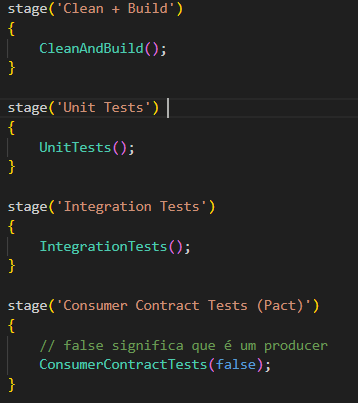
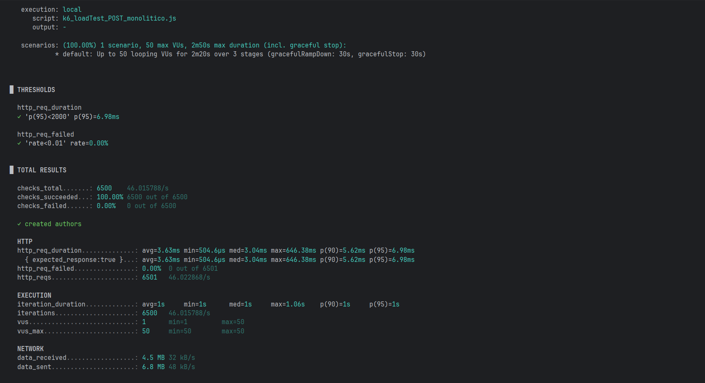
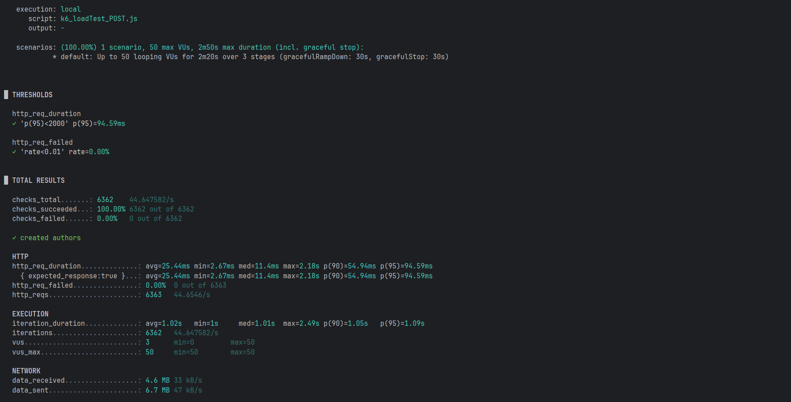

# Documentação de ODSOFT (Organização de Software)

---

## Escolha de Scripted Pipeline vs Declarative Pipeline

Para a implementação dos pipelines Jenkins do projeto LMS, optou-se por utilizar **Scripted Pipelines** em detrimento de Declarative Pipelines.
### 1. **Reutilização de Código**
- **Jenkins Shared Library**: Criação de funções reutilizáveis em `jenkins/vars/` que podem ser invocadas em múltiplas pipelines
- **Exemplo**: Funções como `EnsureK8sStructure`, `EnsureBlueGreenInfrastructure`, `BuildDockerImage` são partilhadas entre todos os microserviços
- **Vantagem**: Evita duplicação de código entre os Jenkinsfiles de diferentes serviços (authnusers-command, authnusers-query, readers-command, readers-query)

### 2. **Facilidade de Manutenção**
- **Centralização da lógica**: Alterações em processos comuns (ex: deploy, build, testes) são feitas uma única vez na biblioteca partilhada
- **Exemplo**: Mudanças no processo de deploy Blue/Green aplicam-se automaticamente a todos os serviços ao atualizar a função `DeployNewColor`
- **Vantagem**: Reduz o risco de inconsistências entre pipelines de diferentes microserviços

### 3. **Organização Clara por Jenkins Library**
- **Estrutura modular**: Cada função tem responsabilidade única e bem definida. Exemplo:
    - `CleanAndBuild.groovy`: Limpeza e compilação do projeto
    - `BuildDockerImage.groovy`: Construção de imagens Docker
    - `DeployNewColor.groovy`: Deploy Blue/Green
- **Melhor legibilidade**: Jenkinsfiles ficam mais simples e declarativos, delegando complexidade para a biblioteca
- **Vantagem**: Separação de responsabilidades e código mais testável

### Exemplo de Jenkinsfile Simplificado

Esta abordagem permite que as pipelines sejam concisas e fáceis de entender, enquanto a lógica complexa permanece encapsulada nas funções da biblioteca partilhada.

---

## Estratégia de Deployment Blue/Green: Versionamento Dinâmico de Imagens Docker

**Abordagem Escolhida:**  
Cada deployment utiliza **tags Docker versionadas dinamicamente** extraídas do Maven (`PROJECT_VERSION`), em vez de uma tag fixa como `1.0`. O deployment da nova cor é criado/atualizado via `kubectl set image` (se existir) ou `kubectl apply` (se não existir), e o deployment antigo é removido após switch de tráfego bem-sucedido.

**Vantagens:**
1. **Versionamento rastreável** - cada release tem tag única no Docker Hub (`1.0`, `1.1`, `1.2`...)
2. **Rollback facilitado** - deploy de versão anterior disponível no Docker Hub a qualquer momento
3. **Separação blue/green clara** - deployments distintos durante fase de validação
4. **Cache consistency** - Kubernetes sempre puxa versão correta (tags únicas evitam cache stale)
5. **Automação completa** - placeholders nos YAMLs (`{{COLOR}}`, `{{IMAGE}}`, `{{NAMESPACE}}`) são substituídos dinamicamente pela pipeline, eliminando necessidade de alterações manuais nos manifestos

**Fluxo de Deployment:**
1. Extrai `PROJECT_VERSION` do `pom.xml` (ex: `1.2.0`)
2. Constrói imagem Docker com tag versionada: `pfcosisep/reader-q:1.2.0`
3. Identifica cor atual através do Service selector (`app=reader-q, color=blue`)
4. Determina nova cor (oposta à atual: `green`)
5. **Substitui placeholders** no YAML do deployment:
    - `{{COLOR}}` → `green`
    - `{{IMAGE}}` → `pfcosisep/reader-q:1.2.0`
    - `{{NAMESPACE}}` → `dev`
6. Aplica deployment processado via `kubectl apply` (se novo) ou `kubectl set image` (se existente)
7. Aguarda deployment estar ready (`kubectl rollout status`)
8. Executa smoke/health tests na instância isolada
9. Atualiza Service selector para apontar para nova cor (switch atómico de tráfego)
10. Remove deployment da cor antiga (liberta recursos do cluster)

**Alternativas Consideradas e Rejeitadas:**

| Alternativa | Razão para Rejeição |
|-------------|---------------------|
| **Tag Docker fixa (`:1.0` ou `:latest`)** | Não permite rastreabilidade de versões deployed Dificulta rollback para versão específica Kubernetes pode usar imagem cached (não puxa nova versão) |
| **Manter ambos deployments (blue+green)** | Dobro de recursos consumidos permanentemente Complexidade na gestão de HPAs duplicados Overhead desnecessário para benefício marginal |
| **Helm Charts** | Complexidade adicional (requer Helm instalado) Overkill para substituição simples de tags |
| **Kustomize overlays** | Estrutura de diretórios mais complexa Overhead excessivo para blue/green simples |

---

## Orquestração de Containers: Kubernetes vs Docker Swarm

**Contexto:**  
O projeto LMS requer orquestração de múltiplos microserviços em ambientes Dev, Staging e Production, com necessidades de auto-scaling, estratégias de deployment e gestão de configurações.

**Alternativas Consideradas:**

| Alternativa | Vantagens | Desvantagens | Decisão |
|-------------|-----------|--------------|---------|
| **Docker Swarm** | Mais simples de configurar Integrado nativamente no Docker Curva de aprendizagem menor | Menor adoção empresarial Ecossistema limitado Menos features avançadas (HPA, RBAC granular) | Rejeitada |
| **Kubernetes** | Standard da indústria (95%+ market share) Ecossistema rico (Helm, Istio, Prometheus) Suporte cloud nativo (AKS, EKS, GKE) Features avançadas (HPA, CronJobs, StatefulSets) | Curva de aprendizagem mais íngreme | **Escolhida** |

**Solução Implementada: Kubernetes**

**Justificação da Escolha:**
1. **Adoção empresarial** - Kubernetes é o standard de facto em ambientes corporativos (usado por Google, Microsoft, AWS, Netflix, Spotify)
2. **Managed services** - Azure AKS, AWS EKS, Google GKE oferecem Kubernetes gerido, simplificando operações (não foi implementado mas era a opção escolhida)

---

## Análise às Pipelines

### Checkout
O stage Checkout é responsável por realizar a obtenção do código-fonte do repositório, garantindo que a pipeline tenha acesso à versão mais recente do projeto para execução dos próximos passos.

### Set Maven Path
Configura o Maven (versão 3.9.11) no PATH do agente Jenkins, assegurando que todos os comandos Maven utilizem a versão correta da ferramenta.

### Clean + Build
Executa o ciclo inicial do Maven para limpar artefatos antigos e compilar o projeto, validando se o código compila corretamente antes de avançar no pipeline.

### Consumer Contract Tests (Pact)
Executa testes de contrato utilizando Pact, garantindo que o serviço esteja em conformidade com os contratos esperados pelos consumidores (modo producer).

### Package
Empacota a aplicação e extrai a versão do projeto (PROJECT_VERSION), que será usada para versionar a imagem Docker.

### Build Docker Image
Cria a imagem Docker da aplicação utilizando a versão gerada pelo Maven, seguindo o padrão:
<docker-registry>/authnusers-c:<versão>

### Push Docker Image
Publica a imagem Docker no registry configurado, tornando-a disponível para deploy no Kubernetes.

### Deploy
Garante a existência da infraestrutura base no Kubernetes (namespace, services e recursos compartilhados).

Se a estratégia escolhida for Blue/Green:
- Identifica a cor atualmente ativa (blue ou green)
- Define a nova cor de deploy
- Atualiza o deployment da nova cor com a nova imagem
- Aguarda o deployment ficar pronto antes de prosseguir

### Test Instance
Executa testes de validação (smoke tests / health checks) na nova instância, antes de qualquer tráfego de produção ser direcionado para ela.
Se os testes falharem, o tráfego não é alterado, garantindo segurança total.

### Switch Traffic to New Instance
Atualiza o Service do Kubernetes para redirecionar o tráfego de produção de forma atômica para a nova versão (blue ou green), garantindo zero downtime.

### Undeploy Old Service
Remove o deployment antigo (cor anterior) após a confirmação de que a nova versão está ativa e funcionando corretamente.

---

## Health Checks

Os serviços implementam **Spring Boot Actuator** com endpoint `/actuator/health` que retorna HTTP 200 quando o serviço está funcional.

A pipeline Jenkins executa health checks automatizados antes de cada switch de tráfego Blue/Green através do script `RunHealthChecks.groovy`:

1. **Validação de Deployment**: Verifica se o deployment da nova cor (blue/green) existe e tem réplicas ready
2. **Validação de Pods**: Confirma que todos os pods estão no estado `Running` e `Ready`
3. **Teste de Endpoint**: Executa `wget` dentro do pod para testar `/actuator/health` **antes** do tráfego ser comutado
4. **Deteção de Restart Loops**: Valida que os pods não estão em crash/restart contínuo

Se qualquer health check falhar, a pipeline aborta automaticamente, evitando deployments de versões problemáticas.

---

## Estratégias de Gestão de Features

O projeto implementa múltiplas estratégias de release para gestão de funcionalidades em produção, incluindo **Kill Switch**, **Beta Access**, **Gradual Release** e **Dark Launch**.

Para informação detalhada sobre a implementação, comportamento e testes de cada estratégia, consultar:

[Feature_Management_Strategies.md](P2-DOCS-ODSOFT/Feature_Management_Strategies.md)

---

---

## Performance

De forma a entender a diferença da performance entre a aplicação base e a aplicação em microserviços foram realizados testes através da ferramenta K6. Foram feitos load tests para entender como as aplicações se comportavam sob carga.

Para estes testes, foi considerado o cenário em que existe um ramp up inicial gradual durante 10 segundos até os 50 users, depois aguenta essa carga durante 120 segundos, e por fim volta de forma gradual aos 0 users durante 10 segundos.

Os resultados foram os seguintes.

### Get author by name

#### Aplicação Monolítica

#### Aplicação Distribuída

Com base nos resultados obtidos, verifica-se que a aplicação monolítica apresenta tempos de resposta inferiores em todas as métricas analisadas (média, mediana e percentis p90 e p95), quando comparada com a aplicação distribuída.

Em particular, o valor de p95 da aplicação distribuída é aproximadamente o dobro do observado na aplicação monolítica, refletindo o overhead introduzido pela execução em ambiente distribuído e pelo balanceamento de carga entre múltiplas réplicas (docker swarm).

### Create Author

#### Aplicação Monolítica

#### Aplicação Distribuída

Com base nos resultados obtidos, verifica-se que, para os pedidos POST, a aplicação monolítica apresenta tempos de resposta significativamente inferiores em todas as métricas analisadas (média, mediana e percentis p90 e p95), quando comparada com a aplicação distribuída.

Em particular, o valor de p95 da aplicação distribuída é substancialmente superior ao da aplicação monolítica (94.59 ms face a 6.98 ms), refletindo o overhead introduzido pela execução em ambiente distribuído, nomeadamente pelos mecanismos de isolamento dos containers, pelo balanceamento de carga e pela gestão de múltiplas instâncias da aplicação.

### Conlusão

Em termos globais, a aplicação monolítica apresenta melhor desempenho em ambos os tipos de pedidos. Os resultados inferiores da aplicação distribuída devem-se principalmente ao overhead introduzido pelo Docker Swarm, nomeadamente pelos mecanismos de encaminhamento e balanceamento de carga do routing mesh, que penalizam a latência em cenários de carga moderada, onde as vantagens da escalabilidade horizontal ainda não são evidentes.

Adicionalmente, importa referir que os testes foram executados num portátil com recursos limitados, o que potencia efeitos de contenção ao nível da CPU, memória e rede, penalizando de forma mais acentuada a aplicação distribuída, devido ao maior overhead associado à virtualização e ao isolamento dos containers.
