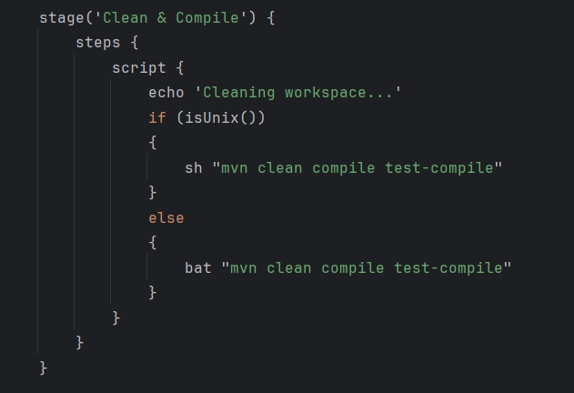
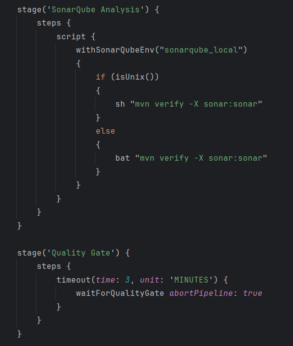
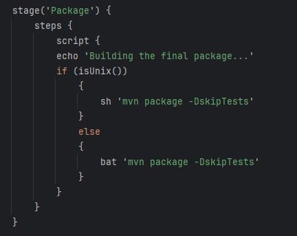
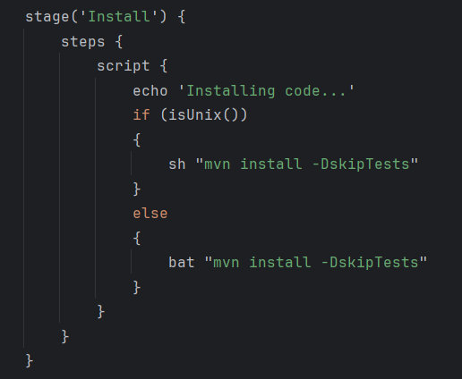
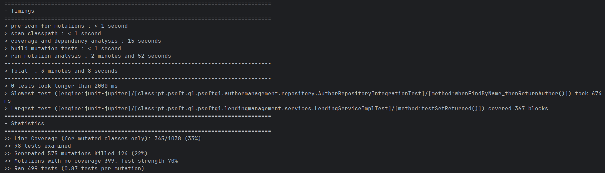

# Documentação de ODSOFT (Organização de Software)

## Análise à Pipeline

### Checkout

O stage Checkout é responsável por realizar a obtenção do código-fonte do repositório, garantindo que a pipeline tenha acesso à versão mais recente do projeto para execução dos próximos passos.

### Clean and Compile

O stage Clean and Compile é responsável por limpar e compilar o projeto. Primeiro executa a limpeza do projeto, removendo arquivos temporários e diretórios gerados em builds anteriores. A seguir, realiza a compilação do código-fonte e dos testes, convertendo os arquivos Java em bytecode e preparando o projeto para as etapas subsequentes da pipeline.

### Unit Tests

O stage Unit Tests é responsável por executar os testes unitários realizados, garantindo que as funcionalidades do código sejam validadas isoladamente e que comportamentos esperados estejam corretos antes de prosseguir para as próximas etapas.
É utilizado o plugin Maven Surefire para executar os testes. Se algum teste falhar, o Surefire reporta o erro e o pipeline é interrompido, impedindo que as próximas etapas sejam executadas.

### Integration Tests
(por realizar)

### Mutation Tests

O stage Mutation Tests é responsável por executar testes de mutação, que avaliam a qualidade e eficácia dos testes unitários existentes ao introduzir mudanças controladas no código. Isso ajuda a identificar se os testes são robustos o suficiente para capturar falhas potenciais.
É utilizado o PIT (Pitest), um framework de testes de mutação para Java, para executar os mesmos. O PIT gera um relatório de cobertura de mutação, mostrando a percentagem de mutações “mortas” (detetadas pelos testes) e “sobreviventes” (não detetadas).

### SonarQube Analysis

O stage SonarQube Analysis é responsável por executar a análise de qualidade do código com o SonarQube, identificando possíveis vulnerabilidades, problemas de segurança e verificando métricas de cobertura de testes. Isso ajuda a manter o código conforme as melhores práticas e padrões de qualidade.
A parte do Quality Gate é responsável por verificar automaticamente se o projeto cumpre os critérios mínimos de qualidade definidos no SonarQube. Caso passe os critérios, permite que a pipeline prossiga.

### Package

O stage Package realiza a geração do artefato do projeto (por exemplo, um arquivo JAR), garantindo que o pacote esteja pronto para implantação, mas sem executar os testes, acelerando o processo de empacotamento.

### Install

O stage Install é responsável por instalar o artefato do projeto gerado no passo anterior, tornando-o disponível para outros módulos ou projetos que dependam dele.

### Deploy
(por realizar)

---
## Critical analysis of the pipeline

### Mutation Tests
#### Primeiro teste de mutação

O primeiro teste de mutação foi feito ao projeto base, e o resultado obtido foi o seguinte:

Os resultados indicam que apenas 22% das mutações geradas foram mortas, o que significa que alguns defeitos podem não ser cobertos pelos testes existentes.

Além disso, 33% de cobertura de linhas de código nas classes mutadas mostra que ainda existe uma parte significativa do código que continua por testar.

#### Segundo teste de mutação

O segundo teste de mutação foi feito já ao projeto em desenvolvimento, e o resultado obtido foi o seguinte:

Os resultados do segundo teste mostram melhorias relativamente aos resultados do projeto base.

É possivel ver que 57% das mutações geradas foram mortas, o que mostra um aumento de mais de 30% em relação aos resultados do primeiro teste.

Em relação à cobertura de linhas de código nas classes mutadas, passamos a ter uma cobertura de 76%, ou seja, um aumento de mais de 40%.